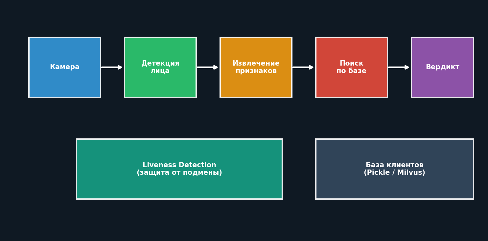
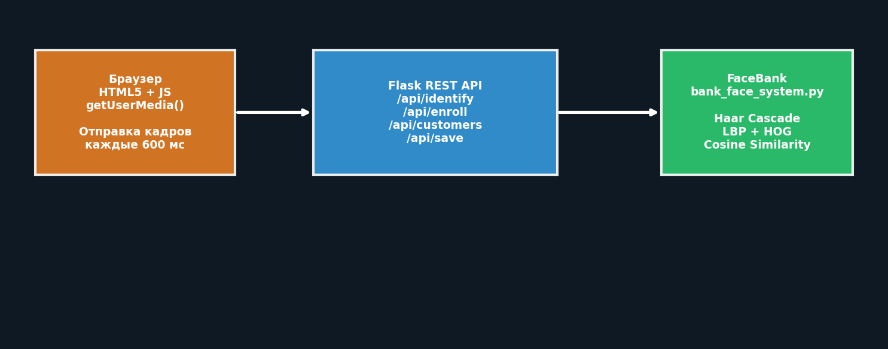
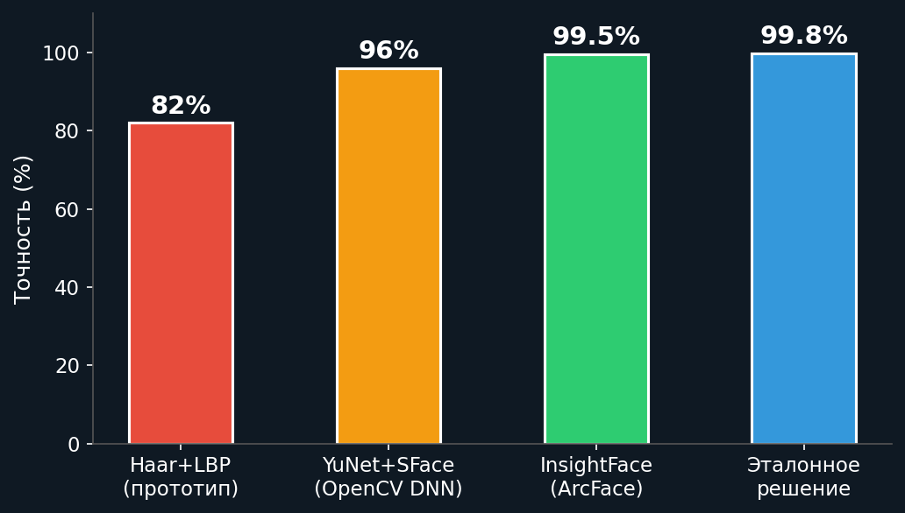

# Биометрическая идентификация по лицу

Прототип системы распознавания клиентов по видеопотоку для банковского
сценария: регистрация в базе, поиск по базе, проверка «живости» лица.

Личный проект, учебный прототип — не продакшн-решение. Ограничения и путь
к рабочей системе описаны ниже честно.

---

## Что умеет

| Функция | Описание |
|---|---|
| Регистрация (enrollment) | добавить клиента в базу по кадру с камеры |
| Идентификация (1:N) | найти человека среди всех, кто есть в базе |
| Верификация (1:1) | проверить, что лицо принадлежит конкретному клиенту |
| Liveness-проверка | отличить живого человека от поднесённой фотографии |

## Как устроено

```
Камера → Детекция лица → Извлечение признаков → Поиск по базе → Вердикт
              ↓                                        ↓
      Liveness-проверка                          СВОЙ / ЧУЖОЙ
```

| Этап | Реализация |
|---|---|
| Детекция лица | мульти-каскадный Haar (5 каскадов) + выравнивание гистограммы CLAHE |
| Признаки | LBP + HOG + гистограмма HSV |
| Сравнение | косинусное сходство |
| Liveness | детекция движения по разнице кадров |
| Хранение | локальный файл, база в репозиторий не входит |



## Два интерфейса

**Десктопный** — `demo.py`, видеопоток через OpenCV GUI, управление клавишами:
`E` — регистрация, `L` — список, `S` — сохранить базу, `Q` — выход.

**Веб** — `web_server.py`, локальный сервер на Flask. Кадры с камеры уходят
на сервер через `getUserMedia`, результат распознавания с процентом совпадения
показывается в браузере. Регистрация — через форму.



## Запуск

```bash
pip install -r requirements.txt
```

Десктопная версия:

```bash
python3 demo.py
```

Веб-версия — затем открыть `http://localhost:8080`:

```bash
python3 web_server.py
```

База клиентов в репозиторий не включена: биометрические данные публиковать
нельзя. При первом запуске зарегистрируйте кого-нибудь сами.

## Ограничения прототипа

Названы прямо, потому что от них зависит применимость:

- **Точность.** Haar + LBP уступает нейросетевым эмбеддингам (ArcFace,
  InsightFace) примерно в 2–3 раза
- **Маски и головные уборы.** Есть запасной путь через детекцию глаз, но
  надёжность падает
- **Освещение.** Чувствительность к резким перепадам
- **Масштабирование.** Хранение в pickle не годится больше чем на ~1000 записей
- **Безопасность.** Биометрия не шифруется — для реальной эксплуатации
  недопустимо

## Что нужно до продакшена

| Этап | Замена |
|---|---|
| Детектор | YuNet (OpenCV DNN) или RetinaFace |
| Признаки | InsightFace / ArcFace |
| Liveness | Silent-Face-Anti-Spoofing |
| Сервис | FastAPI + Redis для сессий |
| Поиск | векторная БД Milvus или Qdrant |
| Хранение | шифрование AES-256, ключи в HSM |

## Подробности

- [`report.md`](report.md) — отчёт: архитектура, интерфейсы, ограничения
- [`presentation.md`](presentation.md) — презентация: задача, сценарии применения
- [`questions.md`](questions.md) — разбор вопросов по системе


